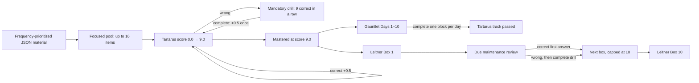

# Tartarus

Tartarus is a local-first active-recall engine for learning English and German vocabulary and sentences from user-owned JSON material.

Its design principle is simple to state and, unusually, actually enforced by the code: **the learner is never asked to make a decision that isn't "what do I already know."** No mode picker, no "which file," no "should I review or learn new material" — Tartarus decides all of that from saved state, and the scoring math is built so that persistence is always rewarded and never punished. See [What you can rely on](#what-you-can-rely-on) below for the specific guarantees, each backed by a test in `utils/test_tartarus.py`.

The project deliberately keeps **learning content** and **learner state** separate:

- JSON under `data/word_lists/` is the source of truth for words, sentences, definitions, ordering, and metadata.
- SQLite stores users, per-item progress, session history, the 10-Day Gauntlet state, and Leitner state.
- The Web UI is served by a small Python localhost server and uses the same scoring engine as the CLI.
- Speech is local through macOS `say`; no cloud speech or remote learning service is required.

The core idea is simple: keep a small set of material in focus long enough to push it toward mastery, avoid unnecessary context switching, and then maintain mastered material with spaced repetition.

---

## What you can rely on

These are the guarantees the engine is built to hold — each one is exercised by the test suite, not just described here.

- **There is no "which file" decision.** Pick a language, a level, and a part of speech; the exact word list resolves automatically. If more than one file could ever match, it's resolved the same deterministic way every time — there is nothing left for you to click.
- **Nothing you earn is ever lost, and nothing ever regresses.** A word's score only ever moves up, in fixed `0.5` steps from `0.0` to `9.0`, or stays exactly where it was. A wrong answer never lowers a score, never demotes a Leitner box, and never resets a Gauntlet day. Its only cost is a bounded corrective drill — nine consecutive correct repetitions — before that item's forward progress resumes exactly where it left off.
- **Progress carries across days untouched.** A word that reaches band 5 today resumes at band 5 tomorrow, not band 0. If it crosses band 9 tomorrow, it enters both the 10-Day Gauntlet's daily track and Leitner Box 1 in the same atomic database update — the two tracks never fall out of sync with each other.
- **Finishing a list is deterministic, not a matter of luck.** The Forging stage — first-time acquisition — stays open until *every* active word in the list has reached band 9. That gate is score-based, not calendar-based, and there is no cap on how many sessions you run in one day. The more intensely you practice, the sooner a list is fully mastered; given enough correct answers, every list finishes. Once past Forging, the same math governs the daily consolidation track: a list reaches its terminal day deterministically, mistakes included, because a mistake only adds bounded drill work, never a setback.

One consequence of all four guarantees together: you can open the app, pick any language/level/part-of-speech you feel like practicing that day, and walk away — there is no wrong list to pick, no fragile state to protect, and no way to lose work by practicing something else first.

---

## Core learning model

Tartarus has two connected learning tracks:

1. **Tartarus / the 10-Day Gauntlet** — acquisition and progressively harder recall.
2. **Lifetime Leitner Maintenance** — spaced repetition for items that have reached Tartarus mastery.

They are presented through one Web entry point: **Enter the Gauntlet**. The learner does not manually choose between separate Tartarus and Leitner modes in the Web UI; the backend decides what the next session needs to be from the saved progress of the selected list.



### Why the focus pool works this way

Normal Tartarus practice uses **at most 16 unique items per session**. Selection and presentation are deliberately separate operations.

#### 1. Select the focus pool

For unfinished items (`score < 9.0`):

1. Higher score is selected before lower score.
2. Equal-score items are ranked by their position in the JSON file.
3. Only the first 16 selected items enter the session.

This keeps near-mastery material in focus instead of constantly replacing it with unrelated new material.

For a completely new file every item has score `0.0`, so the first 16 items in JSON order are selected. The bundled datasets are curated in priority/frequency order, so **JSON order is pedagogically meaningful**.

#### 2. Randomize presentation without destroying priority

After the 16-item pool is chosen, Tartarus randomizes **only items that have the same score**. Different score bands remain in descending-score order.

That gives two benefits at once:

- the learner remains concentrated on the same high-priority material across sessions;
- the exact sequence changes, reducing blind memorization of list position.

Once one focused item reaches score `9.0`, it leaves the unfinished pool and the next eligible JSON-priority item can enter.

---

## Tartarus score progression

Every practice item uses the same score scale:

```text
0.0 → 0.5 → 1.0 → … → 8.5 → 9.0
```

- `0.0` = new.
- `9.0` = Tartarus mastered.
- A correct normal answer adds `0.5`.
- A wrong normal answer **does not lower the score**.
- A completed normal corrective/manual drill adds `0.5` exactly once.
- Scores never exceed `9.0`.

The score also controls how much support the learner receives during the acquisition path.

### Progressive recall in The Forging

For scores below `8.0`, the target is progressively masked as the score rises. The mask is freshly randomized, so the learner cannot rely on one fixed visual pattern.

At scores `8.0–8.5`, the item moves to production-style recall: the target is hidden and the learner must reproduce it from the prompt/definition and available audio.

The purpose is gradual cue removal: recognition support is strongest when material is new and weakest near mastery.

---

## Answer contract

Tartarus uses exact, case-sensitive answer matching.

### Vocabulary entries with multiple forms

A comma-separated vocabulary entry is **one learning target containing several required forms**.

For example:

```text
das Buch, die Bücher
```

The learner must provide that complete literal target exactly:

```text
das Buch, die Bücher
```

Any variation is invalid, including reordered forms, partial forms, or extra whitespace:

```text
die Bücher, das Buch
das Buch
die Bücher
Buch
das Buch, die Bücher<space>
```

Case, spelling, punctuation, spaces, articles, commas, and form order all matter.

This is how German noun singular/plural material is represented. The comma does not split the entry into interchangeable answers.

### Sentence entries

Sentence material follows the same exact literal contract. Leading or trailing whitespace is not trimmed, and commas remain required punctuation.

---

## Corrective drills

A wrong answer immediately starts a mandatory corrective drill for the same item:

```text
9 consecutive correct repetitions
```

- A wrong drill repetition resets only the in-memory drill streak to zero.
- The original mistake never lowers the Tartarus score, Gauntlet day, or Leitner box.
- Normal End/Escape/cancel controls cannot bypass an active drill.
- Drill state is session-local and is not stored as future mistake debt. If the process or session disappears before completion, no forward transition is awarded and no earned progress is erased.

Completing the drill grants exactly the transition that a correct first answer would have granted:

- during acquisition, the score increases by `0.5` once, capped at `9.0`;
- during Days 1–10, the item is completed for that logical Gauntlet day;
- during due maintenance, the item advances one Leitner box, capped at Box 10.

The Shadows stage normally requires two consecutive productions. If either production is wrong, that item escalates to the standard nine-consecutive-correct corrective drill.

### No Sisyphus loop

Mistakes add finite corrective work; they do not send the learner backward. Historical incorrect-answer counts are reporting facts, not a queue of unfinished punishment. The only reset caused by a mistake is the current drill streak. Once the nine-answer drill is completed, the learner resumes from the progress already earned.

---

## The 10-Day Gauntlet

Gauntlet progress is stored independently for each `(user, word-list)` pair.

The roadmap has six stages across days `0–10`:

| Stage | Day(s) | Recall presentation | Prompt audio | Timer |
| --- | ---: | --- | --- | ---: |
| **The Forging** | 0 | score-driven progressive learning/production | automatic when speech is available | none |
| **The Crucible** | 1–2 | target shown with vowels masked; full definition visible | automatic | none |
| **The Shadows** | 3–4 | target hidden; full definition visible; 2 consecutive correct repetitions | automatic | none |
| **The Depths** | 5–6 | target hidden; definition visible | manual replay for the prompt | 10 s |
| **The Void** | 7–8 | target hidden; definition visible | off | 7 s |
| **Ascension** | 9–10 | target hidden; definition visible | off | 5 s |

### Day 0: acquisition gate

The Forging remains unfinished while any active item has `score < 9.0`. Sessions use the focused 16-item selection described earlier until the list has been driven through Tartarus mastery.

### Days 1–10: deterministic daily consolidation

The Forging duration depends on how much new material must first reach score `9.0`. After that acquisition gate, the Gauntlet has ten daily consolidation blocks. A correct first answer or a completed corrective drill marks the same item complete for the current logical day.

Completing a day's required work locks that day for the rest of the calendar date. On the next date, the roadmap advances exactly one day. A mistake cannot reset the day or return the list to an earlier stage; it only adds the mandatory drill before the current item can be completed.

Therefore, when the learner completes each required daily block, the list reaches terminal Day 11 after Days 1–10 even if mistakes occurred and were corrected. This is the deterministic Gauntlet pass. The stronger `learning_complete` milestone additionally requires every active item to reach Leitner Box 10 and therefore follows the longer maintenance schedule.

### Session completion

A normal Web session contains up to 16 unique questions. One correct answer does **not** end a 16-question session; the session advances question by question until the current queue is complete or the learner ends it early.

An early-ended Gauntlet session is recorded as voided for Gauntlet advancement and does not receive full-session progression credit.

---

## Lifetime Leitner Maintenance

Reaching score `9.0` places an item into **Leitner Box 1**.

Tartarus uses ten boxes:

| Box | Review interval |
| ---: | ---: |
| 1 | 1 day |
| 2 | 2 days |
| 3 | 3 days |
| 4 | 4 days |
| 5 | 5 days |
| 6 | 6 days |
| 7 | 7 days |
| 8 | 8 days |
| 9 | 9 days |
| 10 | 10 days |

A mastered item is due when the number of days since `leitner_last_reviewed` reaches the interval for its current box.

Due Leitner material is serviced through the **same Enter the Gauntlet flow** when no Tartarus work is ready for the selected list. Tartarus work has priority; there is no separate Web “Review due” workflow.

For a mastered item:

- a correct first answer keeps the score at `9.0` and advances the box by one, up to Box 10;
- a wrong first answer keeps the box unchanged until the mandatory nine-correct drill is completed, then advances it by one;
- a same-day repeat does not repeatedly advance the Leitner box;
- a completed due review always advances exactly once unless the item is already in Box 10;
- Box 10 remains the terminal maintenance box and continues using the 10-day interval.

The Practice and Report views show this as a horizontal square-box roadmap beside the 10-Day Gauntlet roadmap.

### Engine invariants

Any scoring or session change must preserve these contracts:

1. Tartarus score never decreases and never exceeds `9.0`.
2. Leitner boxes never decrease and never exceed Box 10.
3. Reaching score `9.0` enters Box 1; it does not skip directly to Box 2.
4. Every completed due maintenance review advances exactly one box unless already at Box 10.
5. A wrong answer cannot receive its forward transition until the mandatory drill is completed.
6. Completing a drill grants exactly one transition; it cannot double-advance the item.
7. A completed review updates `leitner_last_reviewed`, preventing same-day repeated advancement.
8. Tartarus daily completion and Leitner advancement are independent transitions.
9. Historical mistakes are reporting data, not outstanding drill debt.
10. A list is `learning_complete` only when the Gauntlet is terminal and every active item is in Box 10.

---

## Speech and interaction model

Speech is provided by the macOS `say` command when available.

Default Web/CLI speech rate:

```text
128 words per minute
```

The Web UI serializes speech so two speech requests do not overlap.

### During prompt speech

The learner may **type into the answer field while the prompt is being spoken**. This is the only interaction intentionally kept available during prompt speech.

Until speech finishes:

- Submit/Enter does not submit the answer;
- action buttons are disabled;
- replay and end actions are blocked;
- navigation between Web views is blocked;
- the card does not change.

The typed text remains in the input when speech finishes, then normal submission/actions are restored.

After an answer is submitted, the UI remains interaction-locked while the answer request, any feedback speech, and the card transition complete.

### Stage-specific audio

- Crucible and Shadows use automatic prompt speech.
- Depths does not automatically speak the prompt; Replay is available.
- Void and Ascension disable prompt/replay speech.
- Where result feedback speech is enabled, the current target is spoken before the next card advances.

On systems without macOS `say`, the application remains usable; `/api/tts` reports speech as unsupported and the browser continues without audio.

---

## Web UI

Start the local server:

```bash
make web
```

Then open:

```text
http://127.0.0.1:9999/
```

The Web UI has four views.

### Practice

The practice selector follows:

```text
User → Language → Level → Part of speech
```

That's the whole decision. Once a part of speech is picked, the exact word list resolves automatically — there is no separate "which file" step to click through, and each dropdown option already shows the word count it resolves to (e.g. `NOUN (381)`), so the choice is never a leap in the dark.

Current categories are:

- English vocabulary
- English sentences
- German vocabulary
- German sentences

The selected list shows:

- current Gauntlet stage/day and remaining daily tasks;
- the six-stage 10-Day Gauntlet roadmap;
- the horizontal ten-box Lifetime Leitner roadmap;
- one **Enter the Gauntlet** action.

During a session, Replay is available only where the stage audio policy permits it, and End is available only outside a mandatory drill. There are no reveal, flag, mastery, or manual-drill shortcuts.

The global Enter shortcut is also part of the flow:

1. after a session summary, Enter returns to setup;
2. Enter again starts the next selected session.

### Report

The report selector follows the same material dimensions, and can be left as broad or as narrow as you want:

```text
User → Language → Level → Part of speech
```

Selecting only a user loads the full cross-list report; adding language/level/part-of-speech narrows it to one list — again, without ever exposing a raw filename. The Report view exposes session statistics, current mastery distribution (as percentages, never raw counts or internal list IDs), Gauntlet progress, the horizontal Leitner roadmap, hard/Nemesis items, and backup controls.

### Word Lists

The editor uses the same selector:

```text
User → Language → Level → Part of speech
```

Editing a shared list creates a user-owned override rather than modifying the bundled shared JSON. Saves are atomic and preserve fields that the editor does not intentionally change. A **Restart progress for this list** action is available once a list is loaded — it zeroes that list's scores, Leitner boxes, and Gauntlet day back to the start (a fresh Forging pass), while leaving session/time history untouched as a record. It's a deliberate, explicit action confined to this management view, not something exposed in the daily Practice flow.

### About

The About view documents the in-app interaction model and learning controls.

---

## CLI

The CLI uses the same JSON material, SQLite progress, scoring, answer matching, and Leitner primitives, but it is a direct practice interface rather than the Web Gauntlet orchestrator.

### Create a user

```bash
make init user=demo
```

Optionally create a personal root-level list:

```bash
make init user=demo list=my_german
```

### Normal practice

```bash
make practice user=demo list=german_noun_a1
```

Normal CLI practice uses the same focused high-score-first selection logic.

### Practice options

Pass supported audio options through `opts`:

```bash
make practice user=demo list=german_noun_a1 opts='--wpm 110 --audio-lang german'
```

- `--audio-lang`: overrides voice-language selection for a custom list id.
- `--wpm`: speech rate; default `128`.

Pedagogical mode flags are intentionally not exposed. The same guided Tartarus-first, Leitner-second decision engine selects the work.

### CLI session controls

```text
/replay   replay audio when the current stage permits it
/quit     end an ordinary session
Ctrl+C    end an ordinary session
```

An active mandatory drill cannot be ended through `/quit` or Ctrl+C; it must be completed before the session proceeds.

---

## Dataset organization

Bundled material lives under:

```text
data/word_lists/<language>/<kind>/<level>/<file>.json
```

One file per `(language, kind, level, part-of-speech)` combination — part of speech is encoded in the filename, not a directory level, since a directory holding exactly one file added nothing. The repository contains English and German vocabulary and sentence material across CEFR levels up to C2; exact level and part-of-speech coverage follows the available source material.

Examples:

```text
data/word_lists/german/vocabulary/a1/german_noun_a1.json
data/word_lists/german/sentences/a1/german_sentences_noun_a1.json
data/word_lists/english/vocabulary/b2/english_verb_b2.json
```

The filename stem is the list id used by the CLI/API, for example:

```text
german_noun_a1
```

Every bundled item carries a stable, explicit `id`, frozen ahead of an earlier corpus consolidation (many numbered `partNN` files per group were merged into the single file above, in part-number order, so the merge changed no word's learner-progress identity). See [data/DATASET_SCHEMA_GUIDE.md](data/DATASET_SCHEMA_GUIDE.md) for the complete schema, naming rules, ordering semantics, personal overrides, stable IDs, and examples.

---

## Personal lists and shared material

Shared material is read from the nested `data/word_lists/` tree.

A user-owned override is stored at the root as:

```text
data/word_lists/<user>_<list-id>.json
```

For that user, a personal file with the same list id takes precedence over the shared file. Other users continue to see the shared version.

Important behavior:

- shared JSON is never rewritten when a user edits it through the Web editor;
- the first personal save persists explicit stable item IDs;
- later edits preserve those IDs;
- item order and unknown fields are preserved unless intentionally changed;
- writes use atomic file replacement;
- user/list names accept lowercase letters, digits, `_`, `-`, `.`, and `!` only.

If bundled `tartarus_sample_*` material exists, adopting personal material retires that user's sample progress/session/Gauntlet state without modifying shared sample JSON or another user's state.

---

## Persistence model

SQLite is progress state, not the learning-content store.

Default database:

```text
data/tartarus.db
```

Per-user/per-list word tables contain:

```text
id
content_id
score
last_practiced
last_tartarus_completed
active
times_practiced
times_correct
times_incorrect
times_drilled
times_mastered
leitner_box
leitner_last_reviewed
```

The current schema version is `4`.

The migration path removes obsolete review-era fields such as `drill_pending`, `times_flagged`, `last_decay_at`, and `stage_reached` while preserving legitimate progress.

Additional SQLite state includes:

- `users`;
- `sessions_<user>` practice history;
- `dataset_progress` for current Gauntlet stage/day/session date.

Material removed from a JSON file is marked inactive in progress instead of silently reassigning that progress to a different item.

---

## Backups

The Web Report view can export/import a logical per-user progress backup.

Backup identity:

```json
{
  "format": "tartarus-progress",
  "version": 2
}
```

A backup includes:

- user metadata;
- all per-list word-progress rows;
- session history;
- Gauntlet progress.

Import is strict and transactional. It is a **replacement restore**, not a merge: the selected user's progress/session/Gauntlet state becomes exactly the validated backup state. If validation or restore fails, the pre-import database state is rolled back.

Dataset JSON files are separate from progress backups and should be backed up/versioned as normal files.

---

## Configuration

Runtime configuration is environment-based.

| Variable | Default | Purpose |
| --- | --- | --- |
| `TARTARUS_DB` | `data/tartarus.db` | SQLite database path |
| `TARTARUS_WORD_LISTS_DIR` | `data/word_lists` | learning-material root |
| `TARTARUS_LOG_FILE` | `tartarus.log` | log path |
| `TARTARUS_LOG_LEVEL` | `INFO` | Python logging level |
| `TARTARUS_HOST` | `127.0.0.1` | Web bind address |
| `TARTARUS_PORT` | `9999` | Web port |
| `TARTARUS_SESSION_TTL_SECONDS` | `1800` | in-memory Web session TTL |
| `TARTARUS_MAX_ACTIVE_SESSIONS` | `100` | maximum in-memory Web sessions |
| `TARTARUS_MAX_REQUEST_BYTES` | `1000000` | maximum JSON request size |

`TARTARUS_TTS_TEST_DELAY_MS` exists only as a deterministic TTS test hook and should not be used as a production speech backend.

---

## Logging

Every backend and frontend event of note lands in one place: `tartarus.log` (rotated at 1&nbsp;MB, three backups kept). It's a plain text file — delete or truncate it any time; nothing depends on it existing between runs.

What's captured, at the default `INFO` level:

- every HTTP request (method, path, query) and every response with status `>= 400` (path, status, error message) — instrumented once at the response layer, so this covers every route automatically, not just a hand-picked subset;
- domain events: a word crossing into mastery, Tartarus/Leitner answers and drill completions, Gauntlet day advancement, word-list sync/save/import/export, user creation, restart actions, and CLI command invocations;
- frontend events, via `POST /api/client-log`: uncaught JavaScript errors and unhandled promise rejections (`window.onerror` / `unhandledrejection`), and every user-visible error message shown by the UI — so a bug surfaced only in the browser still lands in the same log as backend events.

Answer text and correct targets are deliberately excluded from every log line; only structural facts (which word, which list, correct/incorrect, resulting score/box) are recorded.

```bash
TARTARUS_LOG_LEVEL=DEBUG make web   # more verbose, if ever needed
tail -f tartarus.log                # watch it live
```

---

## Local-first security model

The default Web bind is `127.0.0.1` and is intended for local use.

The browser receives the current answer text as part of the local practice payload because reveal, speech, masking, and feedback are client-visible features. The Web API therefore follows a **trusted-local-client** model rather than a hostile-browser exam model.

Do not expose the server to an untrusted network merely by changing `TARTARUS_HOST`; there is no authentication/authorization layer designed for Internet deployment.

---

## Repository layout

```text
README.md                         project and learning-model documentation
Makefile                          common launch commands
data/
  DATASET_SCHEMA_GUIDE.md         material schema and naming guide
  word_lists/                     shared + personal JSON material
  tartarus.db                     local progress DB (Git-ignored)
utils/
  tartarus.py                     material validation, scoring, SQLite, CLI
  tartarus_web.py                 localhost API, sessions, Gauntlet orchestration
  test_tartarus.py                unified test suite
web/
  index.html                      UI structure
  style.css                       UI styling
  app.js                          browser state, practice/report/editor behavior
```

---

## Verification

The project intentionally has one unified Python test file:

```bash
PYTHONPYCACHEPREFIX=/tmp/tartarus-pycache \
python3 utils/test_tartarus.py -v
```

Syntax checks:

```bash
PYTHONPYCACHEPREFIX=/tmp/tartarus-pycache \
python3 -m py_compile utils/tartarus.py utils/tartarus_web.py utils/test_tartarus.py

node --check web/app.js

git diff --check
make help
```

The unified suite covers the current release contracts, including:

- focused 16-item selection and equal-score shuffling;
- complete multi-form German noun answers;
- score/drill/Leitner behavior;
- Gauntlet + Leitner dual-track roadmap;
- no-Sisyphus guarantees across acquisition, all ten daily Gauntlet stages, and maintenance;
- Shadows escalation from its two-production task to a nine-answer drill after a mistake;
- schema-v4 migration;
- stable generated material IDs;
- lossless personal editor saves;
- per-user sample retirement;
- transactional backup restore;
- request idempotency and bounded HTTP failures;
- one-answer-does-not-end-session regression;
- Web speech interaction locking and Enter navigation;
- centered responsive practice layout;
- original six-stage roadmap presence;
- horizontal square Leitner roadmap in Practice and Report;
- Report Part-of-Speech filtering;
- restart-from-scratch progress reset, preserving session history;
- corpus-wide list-id uniqueness and stable-id invariants across the whole bundled dataset;
- request/response and client-reported-error logging;
- the single-test-file policy.

On macOS the browser contract defaults to Safari WebDriver when `safaridriver` is available. Set `TARTARUS_BROWSER=chromium` to use the headless Chromium/CDP fallback, which requires a Chromium/Chrome executable and the Python `websocket-client` module. Browser-specific tests skip only when their selected runtime is unavailable.

---

## Quick start

```bash
# inspect commands
make help

# create a learner
make init user=demo

# start the Web UI
make web

# or practice one list directly in the CLI
make practice user=demo list=german_noun_a1

# CLI report
make report user=demo list=german_noun_a1
```

Then open:

```text
http://127.0.0.1:9999/
```

For dataset authoring and file-layout rules, continue with [data/DATASET_SCHEMA_GUIDE.md](data/DATASET_SCHEMA_GUIDE.md).
