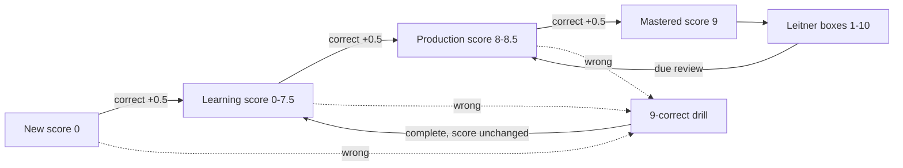

# Tartarus

Tartarus is a local-first active-recall practice engine for user-owned English
and German material. JSON files are the version-controlled source of vocabulary,
sentences, and German noun forms. SQLite stores only users, progress, drill
debt, Gauntlet state, and session history.

The web UI runs only on `127.0.0.1`. No SSH or remote service is required.
Speech uses the macOS `say` command; on other systems the UI remains usable
without speech.

## Learning model



- Vocabulary and sentences use the same score contract: `0.0` through `9.0` in
  half-point increments.
- A wrong answer keeps the score and records persistent drill debt. The debt
  survives session cancellation and server restart until nine consecutive
  correct drill answers clear it.
- Mastered material enters Leitner box 1. Boxes 1 through 10 are reviewed after
  one through ten days respectively.
- Answer controls lock while automatic or replayed speech is running. This is a
  deliberate concentration rule, not a typing-speed constraint.

## Gauntlet

Each list progresses independently through the 10-day Gauntlet. The server
chooses the next session mode from persisted list progress.

| Stage | Days | Prompt | Audio | Timer |
| --- | --- | --- | --- | --- |
| Forging | 0 | standard progressive masking | automatic | none |
| Crucible | 1-2 | heavily masked | automatic | none |
| Shadows | 3-4 | hidden; two correct answers required | automatic | none |
| Depths | 5-6 | hidden definition recall | replay on demand | 10 seconds |
| Void | 7-8 | hidden reverse translation | no automatic speech | 7 seconds |
| Ascension | 9-10 | hidden reverse translation | no automatic speech | 5 seconds |

Any wrong or timed-out Gauntlet answer creates the same persistent nine-correct
drill obligation.

## Interface support

| Workflow | Web UI | CLI |
| --- | --- | --- |
| Gauntlet practice | Yes | No |
| Due-only read-only review | Yes | No |
| Fast, drill-all, mistake drill, known drill, instant drill | No | Yes |

The browser intentionally exposes only the guided Gauntlet and due review. The
CLI exposes the additional explicit practice modes through `make practice` options.

## German nouns

German noun lists use one record per noun with the four cases in this order:
nominative, accusative, dative, genitive. Each case has singular and plural
forms plus learner examples and translations. The web editor validates all
eight forms and practice expands a noun into four stable case items.

## Quick start

```bash
make help
make init user=demo
make web
make practice user=demo list=german_noun_a1_part01
make report user=demo
```

Open <http://127.0.0.1:9999/> after `make web`. Set `TARTARUS_DB` to use an
alternate SQLite progress database. If bundled `tartarus_sample_*` material is
present, it is read-only evaluation material. Once a user has personal
material, those samples are hidden for that user without deleting their sample
progress or history.

## Data and backup

The Word Lists view creates and edits user-owned JSON material. Material saves
preserve metadata, stable item IDs, definitions, frequencies, and type-specific
fields. The API export format is versioned and includes user metadata, all
per-list progress, sessions, and Gauntlet state. Import validates the complete
payload and runs atomically.

## Repository layout

```text
utils/tartarus.py       JSON validation, SQLite progress, scoring, and CLI
utils/tartarus_web.py   localhost JSON API and web server
utils/e2e_backend_test.py isolated HTTP integration test
web/                    vanilla HTML, CSS, and JavaScript UI
data/word_lists/        JSON learning material
data/tartarus.db        local SQLite progress database, ignored by Git
```

## Verification

```bash
PYTHONPYCACHEPREFIX=/tmp/tartarus-pycache python3 utils/test_material_contract.py -v
PYTHONPYCACHEPREFIX=/tmp/tartarus-pycache python3 utils/e2e_backend_test.py -v
node --check web/app.js
```

The committed tests cover material validation, personal-list isolation,
lossless editor saves, noun expansion, scores, drill persistence, Gauntlet day
transitions, progress backup/import, due-only review selection, and an isolated
HTTP drill flow. Browser automation remains a release-gate requirement for
audio timing and full UI interaction paths.
