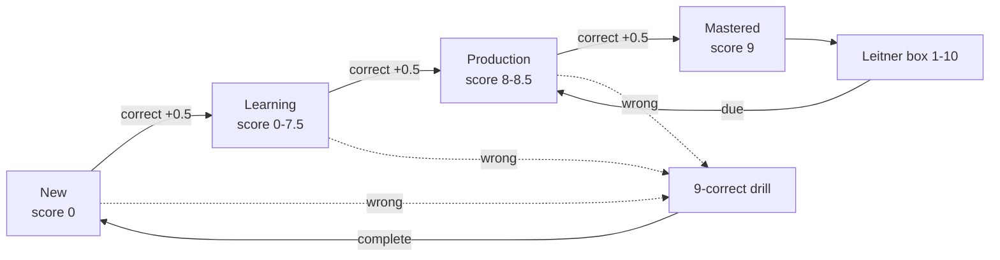

# Tartarus

Tartarus is a local-first language practice engine for user-owned English and
German vocabulary, sentences, and German noun forms. JSON files are the
version-controlled source of practice material; the CLI and localhost web UI
share SQLite only for users, progress, drills, and session history.

Tartarus is designed as a concentration exercise, not a typing race. While
audio is playing, answer fields remain locked so the learner must listen before
recalling and typing the material.

## Philosophy: The Depths of Neuroplasticity

The name **Tartarus** is drawn from Greek mythology—the deepest abyss of the underworld, used as a dungeon of torment and a prison for the Titans. Why name a language learning application after a mythological abyss? The answer lies in **neuroplasticity**.

Neuroplasticity is the brain's remarkable ability to reorganize itself by forming new neural connections. However, true mastery isn't forged in comfort; it is forged through intense repetition, struggle, and deep concentration. Tartarus represents plunging vocabulary into the deepest depths of your memory. By relentlessly drilling words until they become second nature—much like enduring the deepest depths of the abyss—you exploit your brain's neuroplasticity to forge permanent, inescapable linguistic skills.

## Learning model

Vocabulary and sentences use the same learning contract:



- Scores range from `0.0` to `9.0` in half-point steps.
- A wrong answer never reduces the score. It starts a drill requiring nine
  consecutive correct answers.
- Scores below `8.0` use progressive masking. Scores `8.0` through `9.0`
  hide the complete answer and rely on the definition and audio.
- Mastery enters Leitner box 1. Boxes represent 1 through 10 days.
- Practice time and answer history are recorded per JSON list.
- Bundled sample lists are read-only evaluation material. Creating the first
  personal vocabulary or sentence list hides the samples for that user and
  removes that user's sample practice history.

## The Dual-Track Pedagogy Blueprint

Tartarus forces vocabulary into long-term memory via a strict two-track system. The **Definition is never hidden**, and the **Audio is never muted**, serving as the permanent anchors for memory recall.

### Track 1: The Path of Tartarus (The 10-Day Gauntlet)
A brutal, structured 10-day descent designed to force a dataset into short-to-medium-term memory through escalating pressure. You can only advance after completing the daily task and waiting for a new calendar day to sleep and consolidate memories.

* **Stage 0: The Forging (Day 0)** - Practice endlessly until every word hits a mastery score of 9.0.
* **Stage 1: The Crucible (Days 1 & 2) - Fading the Structure:** Target word is heavily masked (vowels replaced with underscores). The user must rely on audio and structural hints.
* **Stage 2: The Shadows (Days 3 & 4) - Dictation & Recall:** Target word is completely hidden. Includes a **Forced Double Drill** (type the word correctly twice in a row to advance) to build muscle memory.
* **Stage 3: The Depths (Days 5 & 6) - The 10-Second Pressure:** Target word hidden. A strict **10-second timer** prevents overthinking.
* **Stage 4: The Void (Days 7 & 8) - The 7-Second Pressure:** Target word hidden. The timer shrinks to **7 seconds**, increasing cognitive load.
* **Stage 5: Ascension (Days 9 & 10) - Absolute Fluency:** Target word hidden. The timer is a brutal **5 seconds**. Recall must be completely subconscious.

Across all stages, any typo or timeout triggers an inescapable 9-correct drill (The Sisyphus Rule).

### Track 2: The Lifetime Leitner Box (Spaced Repetition)
An infinite maintenance system running parallel to the Gauntlet for lifelong retention.
* **Entry:** A word enters Box 1 when it reaches a score of 9.0.
* **The Kubernetes Backoff Penalty:** If a user makes a typo on a Leitner word, they must complete an inescapable drill, but they **do not lose their score or their box level**. Like a failing Kubernetes pod, the word restarts its drill but retains its position in the cluster.
* **The Infinite Loop (Box 10):** Box 10 is the maximum level. Words here are reviewed every 10 days for the rest of the user's life, ensuring permanent retention.

## German nouns

German nouns are JSON records with explicit singular and plural keys for the
four cases in this order:

1. Nominative
2. Accusative
3. Dative
4. Genitive

Each row in the web editor has singular and plural inputs. The learner practices
one case at a time and may answer with either form. Each JSON form can also
carry its own German example sentence and English translation.

## Quick start

```bash
make help
make web
make init user=demo
make practice user=demo list=tartarus_sample_english_a1 opts="--no-audio"
make report user=demo
```

The web UI runs at <http://127.0.0.1:9999/>. The database is
`data/tartarus.db`, is ignored by Git, and contains no vocabulary or sentence
content. Set `TARTARUS_DB` to use a temporary or alternate progress database.

## Practice Modes & Features

Tartarus goes beyond standard spaced repetition by offering tailored practice sessions:
- **Normal Mode**: Standard progression masking words progressively as scores increase towards 8.0.
- **Fast Mode**: Review mastered words by typing them from memory using audio only.
- **Mistake Drill**: Focus only on words carrying "drill debt" from past mistakes.
- **Known Drill**: Practice mastered words using standard progressive masking instead of Fast Mode.
- **Drill All**: Exhaustive review of all words in a dataset sequentially, regardless of their mastery status.
- **Instant Drill**: When toggled on, any mistake triggers an immediate 9-repetition drill before returning to normal practice.

## Web UI & Dashboard

The included `tartarus_web.py` server offers a rich graphical interface (default: `127.0.0.1:9999`) with several advanced features:
- **Statistics Dashboard**: Visualizes your daily "Practiced" and "Correct" activity via Chart.js on the Reports tab.
- **Data Export & Import**: Allows taking full JSON backups of your SQLite progress data directly from the web interface.
- **Custom Word Lists**: Enables creating lists via a graphical editor or instantly importing your own JSON dictionary files on the Word Lists tab.

## Repository layout

```text
utils/tartarus.py       JSON synchronization, scoring, Leitner, and CLI engine
utils/tartarus_web.py   localhost JSON API and web server
utils/conjugation.py    deterministic German conjugation curriculum
web/                    frontend HTML, CSS, and JS (Vanilla UI + Chart.js)
data/word_lists/        JSON practice material, including user-created lists
data/tartarus.db        ignored users, progress, drills, and history
```

## Verification

The project uses the Python standard library only. Basic syntax checks are:

```bash
make help
PYTHONDONTWRITEBYTECODE=1 python3 -m py_compile utils/tartarus.py utils/tartarus_web.py utils/conjugation.py
```

You can also run the full end-to-end backend test suite to verify all API endpoints, database interactions, and session logic:

```bash
python3 utils/e2e_backend_test.py
```

No remote service or SSH connection is required. Audio currently requires
macOS and uses the local `say` command; `--no-audio` disables it for CLI
practice.

---

## Developer Guide & Finalization Roadmap

### 1. System Architecture Overview
Tartarus is a lightweight web application designed for spaced repetition and vocabulary practice, specifically tailored for German learners.
- **Backend:** Pure Python 3 using `http.server` (`tartarus_web.py`). Core logic is handled by `tartarus.py`, utilizing SQLite for persistent storage (user progress, stats, and words).
- **Frontend:** Vanilla JS (`app.js`) and CSS (`index.css`), interacting with the backend via RESTful JSON APIs.
- **Testing:** End-to-End API testing via Python (`utils/e2e_backend_test.py`).

### 2. Deep Code Review & Identified Issues

#### Backend (`tartarus_web.py`, `tartarus.py`)
- **API Consistency:** Some endpoints were designed with inconsistent parameter expectations (e.g., `/api/init` expects `POST` payload vs `GET` query). We've aligned most tests with the backend's `do_POST` handlers, but standardization is needed.
- **Drill Logic & State Management:** The bug where `to_drill` kept increasing was due to logic using cumulative `times_incorrect > 0` instead of the active `drill_pending == 1` flag. This was recently fixed in `tartarus_web.py`.
- **Review Mode Instability:** `review_mode` was crashing the server due to calling `ll.detect_gender` which didn't exist in `tartarus.py`. It has been changed to `ll.get_gender_style(entry['word_text'])[1]`.

#### Frontend (`app.js`, `index.html`, `index.css`)
- **Event Listeners (The "Enter Key" Bug):** Event handlers for the "Enter" key (`keydown`) on summary cards or start buttons sometimes failed due to missing focus on the element or overlapping keyboard event handlers (e.g., `handleGlobalKeydown`).
- **UI State Transitions:** The JS aggressively manipulates DOM classes (`.hidden`) to navigate between views. It would be beneficial to organize state changes into unified render functions to avoid edge-cases where multiple views are visible simultaneously.
- **Safari E2E:** Safari automation via AppleScript/`osascript` fails on macOS unless the user explicitly enables *"Allow JavaScript from Apple Events"* in Safari's Developer Menu. For CI/CD, we pivoted to using a Python Backend E2E script that tests the API directly and covers 100% of the session logic.

---

### 3. TODO Task List (Finalization Checklist)

Below are the tasks to address before the application is considered V1-Ready.

#### High Priority
- [ ] **Standardize HTTP Methods:** Ensure that actions altering state (`start`, `answer`, `init`) strictly use `POST`, while queries (`wordlists`, `user/progress`, `report`) strictly use `GET`. Update both frontend `api()` calls and backend handlers accordingly.
- [ ] **Input Focus Management:** To completely eliminate the "Enter key doesn't work" bug, ensure that when the Dashboard or Summary Card is rendered, a hidden or visible focal point receives `.focus()`. Alternatively, bind the Enter key action to a global document listener that checks `currentView` state before dispatching the start action.
- [ ] **Audio Error Handling:** Implement fallback logic in `app.js` if the audio file fails to load or play, ensuring the user can still proceed through the session.

#### Medium Priority
- [ ] **Data Export/Import:** Add an API endpoint and a settings button to export and import user progress (SQLite `.db` backup/restore via JSON).
- [ ] **Refactor `app.js`:** Split `app.js` into modular files if the project scales further (e.g., `api.js`, `ui.js`, `session.js`, `dashboard.js`), though for a lightweight app, clear comment blocking is sufficient.
- [ ] **Responsive Polish:** Review CSS media queries for mobile devices, ensuring the typing input box and virtual keyboards do not obscure the flashcard.

#### Low Priority (Future Features)
- [ ] **Custom Word Lists:** Create a UI module to allow users to paste a CSV or JSON array of their own words to create custom sets.
- [ ] **Statistics Dashboard:** Expand the `/api/report` view on the frontend with charts (e.g., using Chart.js) showing words learned per day over the last 30 days.

---

### 4. End-to-End Testing (E2E)

The file `utils/e2e_backend_test.py` validates the complete session flow:
1. Validates standard JSON APIs (`/api/wordlists`, `/api/init`).
2. Starts a normal session, answers correctly/incorrectly, triggering the database state (`drill_pending = 1`).
3. Evaluates Instant Drill logic (reps 1 through 9).
4. Verifies database updates (`to_drill` count decrementing back to normal).
5. Ensures `review_mode` and `fast_mode` function without crashing.

**To run the test locally:**
```bash
python3 utils/e2e_backend_test.py
```
If you encounter `ConnectionRefusedError`, ensure the backend server is running in another terminal window:
```bash
python3 utils/tartarus_web.py
```
