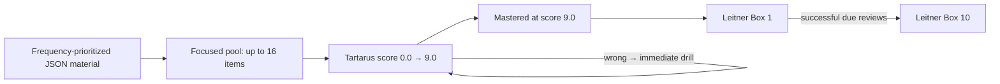

# Tartarus

Tartarus is a local-first active-recall engine for learning English and German vocabulary and sentences from user-owned JSON material.

The project deliberately keeps **learning content** and **learner state** separate:

- JSON under `data/word_lists/` is the source of truth for words, sentences, definitions, ordering, and metadata.
- SQLite stores users, per-item progress, session history, the 10-Day Gauntlet state, and Leitner state.
- The Web UI is served by a small Python localhost server and uses the same scoring engine as the CLI.
- Speech is local through macOS `say`; no cloud speech or remote learning service is required.

The core idea is simple: keep a small set of material in focus long enough to push it toward mastery, avoid unnecessary context switching, and then maintain mastered material with spaced repetition.

---

## Core learning model

Tartarus has two connected learning tracks:

1. **Tartarus / the 10-Day Gauntlet** — acquisition and progressively harder recall.
2. **Lifetime Leitner Maintenance** — spaced repetition for items that have reached Tartarus mastery.

They are presented through one Web entry point: **Enter the Gauntlet**. The learner does not manually choose between separate Tartarus and Leitner modes in the Web UI; the backend decides what the next session needs to be from the saved progress of the selected list.



### Why the focus pool works this way

Normal Tartarus practice uses **at most 16 unique items per session**. Selection and presentation are deliberately separate operations.

#### 1. Select the focus pool

For unfinished items (`score < 9.0`):

1. Higher score is selected before lower score.
2. Equal-score items are ranked by their position in the JSON file.
3. Only the first 16 selected items enter the session.

This keeps near-mastery material in focus instead of constantly replacing it with unrelated new material.

For a completely new file every item has score `0.0`, so the first 16 items in JSON order are selected. The bundled datasets are curated in priority/frequency order, so **JSON order is pedagogically meaningful**.

#### 2. Randomize presentation without destroying priority

After the 16-item pool is chosen, Tartarus randomizes **only items that have the same score**. Different score bands remain in descending-score order.

That gives two benefits at once:

- the learner remains concentrated on the same high-priority material across sessions;
- the exact sequence changes, reducing blind memorization of list position.

Once one focused item reaches score `9.0`, it leaves the unfinished pool and the next eligible JSON-priority item can enter.

---

## Tartarus score progression

Every practice item uses the same score scale:

```text
0.0 → 0.5 → 1.0 → … → 8.5 → 9.0
```

- `0.0` = new.
- `9.0` = Tartarus mastered.
- A correct normal answer adds `0.5`.
- A wrong normal answer **does not lower the score**.
- A completed normal corrective/manual drill adds `0.5` exactly once.
- Scores never exceed `9.0`.

The score also controls how much support the learner receives during the acquisition path.

### Progressive recall in The Forging

For scores below `8.0`, the target is progressively masked as the score rises. The mask is freshly randomized, so the learner cannot rely on one fixed visual pattern.

At scores `8.0–8.5`, the item moves to production-style recall: the target is hidden and the learner must reproduce it from the prompt/definition and available audio.

The purpose is gradual cue removal: recognition support is strongest when material is new and weakest near mastery.

---

## Answer contract

Tartarus uses exact, case-sensitive answer matching.

### Vocabulary entries with multiple forms

A comma-separated vocabulary entry is **one learning target containing several required forms**.

For example:

```text
das Buch, die Bücher
```

The learner must provide the complete set. These are valid:

```text
das Buch, die Bücher
die Bücher, das Buch
```

These are not valid:

```text
das Buch
die Bücher
Buch
```

Whitespace around commas and the order of the forms are ignored; spelling and case are not.

This is how German noun singular/plural material is represented. There is **no special four-case noun subsystem** and no noun-specific practice API.

### Sentence entries

Sentence material is compared as a complete literal answer after trimming outer whitespace. Commas inside a sentence remain punctuation, not form separators.

---

## Corrective drills

A wrong Web/Gauntlet answer immediately starts a corrective drill for the same item.

Normal drill target:

```text
9 consecutive correct repetitions
```

- A wrong drill repetition resets the streak to zero.
- The original wrong answer preserves the current score.
- Completing the drill records one drill completion and advances the score by `0.5`.
- Corrective drill state is **session-local only**. It is not stored as future drill debt.
- Ending/cancelling a session abandons the unfinished in-memory drill; the next session is selected normally.

The Shadows stage has its own stage-specific two-correct repetition requirement, described below.

---

## The 10-Day Gauntlet

Gauntlet progress is stored independently for each `(user, word-list)` pair.

The roadmap has six stages across days `0–10`:

| Stage | Day(s) | Recall presentation | Prompt audio | Timer |
| --- | ---: | --- | --- | ---: |
| **The Forging** | 0 | score-driven progressive learning/production | automatic when speech is available | none |
| **The Crucible** | 1–2 | target shown with vowels masked; full definition visible | automatic | none |
| **The Shadows** | 3–4 | target hidden; full definition visible; 2 consecutive correct repetitions | automatic | none |
| **The Depths** | 5–6 | target hidden; definition visible | manual replay for the prompt | 10 s |
| **The Void** | 7–8 | target hidden; definition visible | off | 7 s |
| **Ascension** | 9–10 | target hidden; definition visible | off | 5 s |

### Day 0: acquisition gate

The Forging remains unfinished while any active item has `score < 9.0`. Sessions use the focused 16-item selection described earlier until the list has been driven through Tartarus mastery.

### Days 1–10: daily consolidation

After The Forging, later stages operate as daily work. The system tracks the current Gauntlet day and the date on which material was last practiced. A completed day advances only through the calendar-day transition; completing today's work does not let the learner repeatedly rush through several Gauntlet days in one sitting.

Once the current day's required work is complete, the Web flow locks that list for the rest of the day and asks the learner to return on the next day.

### Session completion

A normal Web session contains up to 16 unique questions. One correct answer does **not** end a 16-question session; the session advances question by question until the current queue is complete or the learner ends it early.

An early-ended Gauntlet session is recorded as voided for Gauntlet advancement and does not receive full-session progression credit.

---

## Lifetime Leitner Maintenance

Reaching score `9.0` places an item into **Leitner Box 1**.

Tartarus uses ten boxes:

| Box | Review interval |
| ---: | ---: |
| 1 | 1 day |
| 2 | 2 days |
| 3 | 3 days |
| 4 | 4 days |
| 5 | 5 days |
| 6 | 6 days |
| 7 | 7 days |
| 8 | 8 days |
| 9 | 9 days |
| 10 | 10 days |

A mastered item is due when the number of days since `last_practiced` reaches the interval for its current box.

On Gauntlet days after Day 0, due Leitner material is serviced through the **same Enter the Gauntlet flow** before ordinary stage material when maintenance is available. There is no separate Web “Review due” workflow.

For a mastered item:

- a successful eligible review keeps the score at `9.0` and advances the box by one, up to Box 10;
- a same-day repeat does not repeatedly advance the Leitner box;
- a drill on an already-mastered item does not advance its box;
- Box 10 remains the terminal maintenance box and continues using the 10-day interval.

The Practice and Report views show this as a horizontal square-box roadmap beside the 10-Day Gauntlet roadmap.

---

## Speech and interaction model

Speech is provided by the macOS `say` command when available.

Default Web/CLI speech rate:

```text
128 words per minute
```

The Web UI serializes speech so two speech requests do not overlap.

### During prompt speech

The learner may **type into the answer field while the prompt is being spoken**. This is the only interaction intentionally kept available during prompt speech.

Until speech finishes:

- Submit/Enter does not submit the answer;
- action buttons are disabled;
- replay/flag/master/drill/end actions are blocked;
- navigation between Web views is blocked;
- the card does not change.

The typed text remains in the input when speech finishes, then normal submission/actions are restored.

After an answer is submitted, the UI remains interaction-locked while the answer request, any feedback speech, and the card transition complete.

### Stage-specific audio

- Crucible and Shadows use automatic prompt speech.
- Depths does not automatically speak the prompt; Replay is available.
- Void and Ascension disable prompt/replay speech.
- Where result feedback speech is enabled, the current target is spoken before the next card advances.

On systems without macOS `say`, the application remains usable; `/api/tts` reports speech as unsupported and the browser continues without audio.

---

## Web UI

Start the local server:

```bash
make web
```

Then open:

```text
http://127.0.0.1:9999/
```

The Web UI has four views.

### Practice

The practice selector follows:

```text
User → Category → Level → Part of speech → Word list
```

Current categories are:

- English vocabulary
- English sentences
- German vocabulary
- German sentences

The selected list shows:

- current Gauntlet stage/day and remaining daily tasks;
- the six-stage 10-Day Gauntlet roadmap;
- the horizontal ten-box Lifetime Leitner roadmap;
- one **Enter the Gauntlet** action.

During a session the learner can use the buttons or corresponding commands for Replay, Reveal, Flag, Master, Drill, and End where the current stage permits them.

The global Enter shortcut is also part of the flow:

1. after a session summary, Enter returns to setup;
2. Enter again starts the next selected session.

### Report

The report selector follows the same material dimensions:

```text
User → Category → Level → Part of speech → Word list
```

The Report view exposes session statistics, current mastery distribution, Gauntlet progress, the horizontal Leitner roadmap, hard/Nemesis items, and backup controls.

### Word Lists

The editor uses:

```text
User → Category → Level → Part of speech → Word list
```

Editing a shared list creates a user-owned override rather than modifying the bundled shared JSON. Saves are atomic and preserve fields that the editor does not intentionally change.

### About

The About view documents the in-app interaction model and learning controls.

---

## CLI

The CLI uses the same JSON material, SQLite progress, scoring, answer matching, and Leitner primitives, but it is a direct practice interface rather than the Web Gauntlet orchestrator.

### Create a user

```bash
make init user=demo
```

Optionally create a personal root-level list:

```bash
make init user=demo list=my_german
```

### Normal practice

```bash
make practice user=demo list=german_noun_a1_part01
```

Normal CLI practice uses the same focused high-score-first selection logic.

### Supported CLI modes

Pass options through `opts`:

```bash
make practice user=demo list=german_noun_a1_part01 opts='--fast'
make practice user=demo list=german_noun_a1_part01 opts='--drill'
make practice user=demo list=german_noun_a1_part01 opts='--instant-drill'
make practice user=demo list=german_noun_a1_part01 opts='--known-drill-mode'
make practice user=demo list=german_noun_a1_part01 opts='--wpm 110'
```

- `--fast`: mastered items, oldest Fast-review marker first; normal score/counters stay unchanged.
- `--drill`: every selected item starts in the 9-correct drill.
- `--instant-drill`: any wrong answer immediately starts the corrective drill.
- `--known-drill-mode`: drills mastered items in review order without changing score or Leitner box.
- `--audio-lang`: overrides voice-language selection for a custom list id.
- `--wpm`: speech rate; default `128`.

The obsolete `--drill-mode` option is not supported.

### CLI session commands

```text
!! / Ctrl+C   end the session
?             reveal before mastery
+             replay audio
!             flag the current item without changing its score/box
@             mark the current item as mastered (score 9.0)
$             start a strict 9-correct manual drill
```

---

## Dataset organization

Bundled material lives under:

```text
data/word_lists/<language>/<kind>/<level>/<part-of-speech>/<file>.json
```

The current repository contains English and German material across vocabulary and sentence datasets, CEFR A1–C2, and noun/verb/adjective/adverb groups.

Examples:

```text
data/word_lists/german/vocabulary/a1/noun/german_noun_a1_part01.json
data/word_lists/german/sentences/a1/noun/german_sentences_noun_a1_part01.json
data/word_lists/english/vocabulary/b2/verb/english_verb_b2_part01.json
```

The filename stem is the list id used by the CLI/API, for example:

```text
german_noun_a1_part01
```

See [data/DATASET_SCHEMA_GUIDE.md](data/DATASET_SCHEMA_GUIDE.md) for the complete schema, naming rules, ordering semantics, personal overrides, stable IDs, and examples.

---

## Personal lists and shared material

Shared material is read from the nested `data/word_lists/` tree.

A user-owned override is stored at the root as:

```text
data/word_lists/<user>_<list-id>.json
```

For that user, a personal file with the same list id takes precedence over the shared file. Other users continue to see the shared version.

Important behavior:

- shared JSON is never rewritten when a user edits it through the Web editor;
- the first personal save persists explicit stable item IDs;
- later edits preserve those IDs;
- item order and unknown fields are preserved unless intentionally changed;
- writes use atomic file replacement;
- user/list names accept lowercase letters, digits, `_`, `-`, `.`, and `!` only.

If bundled `tartarus_sample_*` material exists, adopting personal material retires that user's sample progress/session/Gauntlet state without modifying shared sample JSON or another user's state.

---

## Persistence model

SQLite is progress state, not the learning-content store.

Default database:

```text
data/tartarus.db
```

Per-user/per-list word tables contain:

```text
id
content_id
score
last_practiced
active
times_practiced
times_correct
times_incorrect
times_drilled
times_mastered
leitner_box
last_known_review_at
```

The current schema version is:

```text
3
```

The migration path removes obsolete review-era fields such as `drill_pending`, `times_flagged`, `last_decay_at`, and `stage_reached` while preserving legitimate progress.

Additional SQLite state includes:

- `users`;
- `sessions_<user>` practice history;
- `dataset_progress` for current Gauntlet stage/day/session date.

Material removed from a JSON file is marked inactive in progress instead of silently reassigning that progress to a different item.

---

## Backups

The Web Report view can export/import a logical per-user progress backup.

Backup identity:

```json
{
  "format": "tartarus-progress",
  "version": 1
}
```

A backup includes:

- user metadata;
- all per-list word-progress rows;
- session history;
- Gauntlet progress.

Import is strict and transactional. It is a **replacement restore**, not a merge: the selected user's progress/session/Gauntlet state becomes exactly the validated backup state. If validation or restore fails, the pre-import database state is rolled back.

Dataset JSON files are separate from progress backups and should be backed up/versioned as normal files.

---

## Configuration

Runtime configuration is environment-based.

| Variable | Default | Purpose |
| --- | --- | --- |
| `TARTARUS_DB` | `data/tartarus.db` | SQLite database path |
| `TARTARUS_WORD_LISTS_DIR` | `data/word_lists` | learning-material root |
| `TARTARUS_LOG_FILE` | `tartarus.log` | log path |
| `TARTARUS_LOG_LEVEL` | `INFO` | Python logging level |
| `TARTARUS_HOST` | `127.0.0.1` | Web bind address |
| `TARTARUS_PORT` | `9999` | Web port |
| `TARTARUS_SESSION_TTL_SECONDS` | `1800` | in-memory Web session TTL |
| `TARTARUS_MAX_ACTIVE_SESSIONS` | `100` | maximum in-memory Web sessions |
| `TARTARUS_MAX_REQUEST_BYTES` | `1000000` | maximum JSON request size |

`TARTARUS_TTS_TEST_DELAY_MS` exists only as a deterministic TTS test hook and should not be used as a production speech backend.

---

## Local-first security model

The default Web bind is `127.0.0.1` and is intended for local use.

The browser receives the current answer text as part of the local practice payload because reveal, speech, masking, and feedback are client-visible features. The Web API therefore follows a **trusted-local-client** model rather than a hostile-browser exam model.

Do not expose the server to an untrusted network merely by changing `TARTARUS_HOST`; there is no authentication/authorization layer designed for Internet deployment.

---

## Repository layout

```text
README.md                         project and learning-model documentation
Makefile                          common launch commands
data/
  DATASET_SCHEMA_GUIDE.md         material schema and naming guide
  word_lists/                     shared + personal JSON material
  tartarus.db                     local progress DB (Git-ignored)
utils/
  tartarus.py                     material validation, scoring, SQLite, CLI
  tartarus_web.py                 localhost API, sessions, Gauntlet orchestration
  test_tartarus.py                unified test suite
web/
  index.html                      UI structure
  style.css                       UI styling
  app.js                          browser state, practice/report/editor behavior
```

---

## Verification

The project intentionally has one unified Python test file:

```bash
PYTHONPYCACHEPREFIX=/tmp/tartarus-pycache \
python3 utils/test_tartarus.py -v
```

Syntax checks:

```bash
PYTHONPYCACHEPREFIX=/tmp/tartarus-pycache \
python3 -m py_compile utils/tartarus.py utils/tartarus_web.py utils/test_tartarus.py

node --check web/app.js

git diff --check
make help
```

The unified suite covers the current release contracts, including:

- focused 16-item selection and equal-score shuffling;
- complete multi-form German noun answers;
- score/drill/Leitner behavior;
- Gauntlet + Leitner dual-track roadmap;
- schema-v3 migration;
- stable generated material IDs;
- lossless personal editor saves;
- per-user sample retirement;
- transactional backup restore;
- request idempotency and bounded HTTP failures;
- one-answer-does-not-end-session regression;
- Web speech interaction locking and Enter navigation;
- centered responsive practice layout;
- original six-stage roadmap presence;
- horizontal square Leitner roadmap in Practice and Report;
- Report Part-of-Speech filtering;
- the single-test-file policy.

Browser contract tests run the shipped HTML/CSS/JavaScript in headless Chromium through the Chrome DevTools Protocol. They require a Chromium/Chrome executable and the Python `websocket-client` module; if no Chromium executable is available, the browser-specific contract is skipped.

---

## Quick start

```bash
# inspect commands
make help

# create a learner
make init user=demo

# start the Web UI
make web

# or practice one list directly in the CLI
make practice user=demo list=german_noun_a1_part01

# CLI report
make report user=demo list=german_noun_a1_part01
```

Then open:

```text
http://127.0.0.1:9999/
```

For dataset authoring and file-layout rules, continue with [data/DATASET_SCHEMA_GUIDE.md](data/DATASET_SCHEMA_GUIDE.md).
