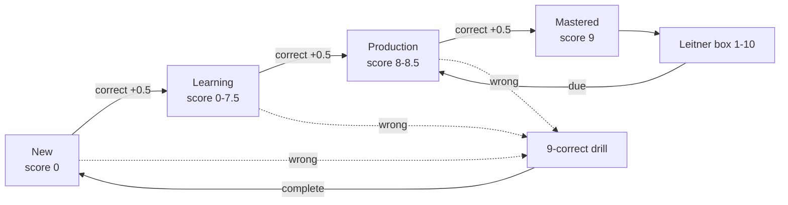

# Tartarus

Tartarus is a local-first language practice engine for user-owned English and
German vocabulary, sentences, and German noun forms. JSON files are the
version-controlled source of practice material; the CLI and localhost web UI
share SQLite only for users, progress, drills, and session history.

Tartarus is designed as a concentration exercise, not a typing race. While
audio is playing, answer fields remain locked so the learner must listen before
recalling and typing the material.

## Learning model

Vocabulary and sentences use the same learning contract:



- Scores range from `0.0` to `9.0` in half-point steps.
- A wrong answer never reduces the score. It starts a drill requiring nine
  consecutive correct answers.
- Scores below `8.0` use progressive masking. Scores `8.0` through `9.0`
  hide the complete answer and rely on the definition and audio.
- Mastery enters Leitner box 1. Boxes represent 1 through 10 days.
- Practice time and answer history are recorded per JSON list.
- Bundled sample lists are read-only evaluation material. Creating the first
  personal vocabulary or sentence list hides the samples for that user and
  removes that user's sample practice history.

## German nouns

German nouns are JSON records with explicit singular and plural keys for the
four cases in this order:

1. Nominative
2. Accusative
3. Dative
4. Genitive

Each row in the web editor has singular and plural inputs. The learner practices
one case at a time and may answer with either form. Each JSON form can also
carry its own German example sentence and English translation.

## Quick start

```bash
make help
make web
make init user=demo
make practice user=demo list=tartarus_sample_english_a1 opts="--no-audio"
make report user=demo
```

The web UI runs at <http://127.0.0.1:9999/>. The database is
`data/tartarus.db`, is ignored by Git, and contains no vocabulary or sentence
content. Set `TARTARUS_DB` to use a temporary or alternate progress database.

## Practice Modes & Features

Tartarus goes beyond standard spaced repetition by offering tailored practice sessions:
- **Normal Mode**: Standard progression masking words progressively as scores increase towards 8.0.
- **Fast Mode**: Review mastered words by typing them from memory using audio only.
- **Mistake Drill**: Focus only on words carrying "drill debt" from past mistakes.
- **Known Drill**: Practice mastered words using standard progressive masking instead of Fast Mode.
- **Drill All**: Exhaustive review of all words in a dataset sequentially, regardless of their mastery status.
- **Instant Drill**: When toggled on, any mistake triggers an immediate 9-repetition drill before returning to normal practice.

## Web UI & Dashboard

The included `tartarus_web.py` server offers a rich graphical interface (default: `127.0.0.1:9999`) with several advanced features:
- **Statistics Dashboard**: Visualizes your daily "Practiced" and "Correct" activity via Chart.js on the Reports tab.
- **Data Export & Import**: Allows taking full JSON backups of your SQLite progress data directly from the web interface.
- **Custom Word Lists**: Enables creating lists via a graphical editor or instantly importing your own JSON dictionary files on the Word Lists tab.

## Repository layout

```text
utils/tartarus.py       JSON synchronization, scoring, Leitner, and CLI engine
utils/tartarus_web.py   localhost JSON API and web server
utils/conjugation.py    deterministic German conjugation curriculum
web/                    frontend HTML, CSS, and JS (Vanilla UI + Chart.js)
data/word_lists/        JSON practice material, including user-created lists
data/tartarus.db        ignored users, progress, drills, and history
```

## Verification

The project uses the Python standard library only. Basic syntax checks are:

```bash
make help
PYTHONDONTWRITEBYTECODE=1 python3 -m py_compile utils/tartarus.py utils/tartarus_web.py utils/conjugation.py
```

You can also run the full end-to-end backend test suite to verify all API endpoints, database interactions, and session logic:

```bash
python3 e2e_backend_test.py
```

No remote service or SSH connection is required. Audio currently requires
macOS and uses the local `say` command; `--no-audio` disables it for CLI
practice.
