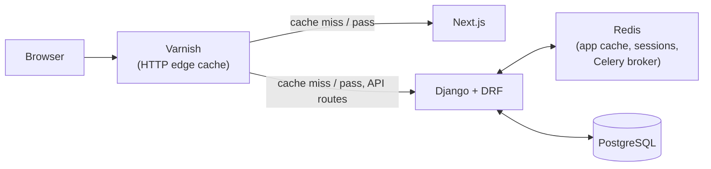

# 06 — Caching: Redis and Varnish

Two caches, two jobs, two positions in the request path. Conflating them —
or worse, only having one and using it for both jobs — is the most common
caching mistake in real systems, so keeping the boundary sharp is itself
part of the lesson.



## 6.1 Redis — inside the trust boundary, per-request, personalized

Redis sits **behind** Django, never in front of it, and is used for state
that is either ephemeral or inherently per-user:

- **Live practice session state** — the Redis-backed replacement for the
  legacy in-process `SESSIONS` dict, detailed in `03` §3.3. This is the
  single most important Redis use in the whole system: it's mutated on
  almost every request during a practice session, must survive across
  multiple backend replicas (any replica can serve the next question), and
  must expire on its own after inactivity. Native `SETEX` TTL replaces the
  legacy app's manual sweep.
- **Django's cache framework backend** — computed, moderately expensive,
  *shared-across-users* payloads: a word list's item content (rarely
  changes, read constantly), the Consolidation Track roadmap shape for a
  given list. Short TTL (minutes) plus explicit invalidation on write
  (word list edited → cache key for that list's content is deleted).
- **Celery broker** — background jobs: the Mongo→ClickHouse ETL trigger
  (`05`), audio pregeneration (`03` §3.8). Redis-as-broker is the simplest
  Celery setup and is more than sufficient at this scale; RabbitMQ is the
  standard alternative worth a one-paragraph mention in class but not
  worth the extra operational surface for this project.
- **Django session store** (for session-cookie auth, `03` §3.5) and a
  natural home for simple rate limiting (login attempts, answer-submission
  throttling) via `django-ratelimit` or similar, backed by the same Redis
  instance.

None of this is cached at the HTTP layer — it's all *inside* the request
handling, personalized per authenticated user, and must never be served to
the wrong learner. That boundary is exactly why it isn't Varnish's job.

## 6.2 Varnish — in front of everything, HTTP-shaped, cacheable-by-definition only

Varnish caches **whole HTTP responses**, keyed by URL (and optionally
headers/cookies), before a request ever reaches Next.js or Django. It can
only safely cache things that are the same for everyone (or safely
variant-keyed) and clearly not personalized:

**Cacheable through Varnish:**
- Word list content served publicly (e.g., a "browse available material"
  page, if the app exposes one) — same response for every visitor.
- Next.js static assets and any statically-generated pages (About, landing).
- The public ClickHouse-backed *read-only* embed of a Grafana panel, if
  the class demo wants one shareable, non-authenticated dashboard URL.

**Never cached through Varnish (explicit `pass`):**
- Anything under the authenticated practice/session API — every response
  is per-user, and even a short accidental cache hit here means one
  learner's next question could be served to another learner. This is
  stated explicitly because it's the single most dangerous Varnish
  misconfiguration class in real systems (cache poisoning across users),
  and it's worth having students find and fix a deliberately-broken VCL
  rule that caches an authenticated endpoint as a lab exercise.
- Anything carrying a `Set-Cookie` response header, by Varnish's own
  sane defaults — this should be treated as a safety net, not the only
  line of defense; the VCL should be explicit about which paths are
  cacheable rather than relying on cookie-detection alone.

### Illustrative VCL shape (sketch, not final config)

```vcl
sub vcl_recv {
    if (req.url ~ "^/api/practice/") {
        return (pass);          # never cache live session traffic
    }
    if (req.url ~ "^/api/wordlist/public/") {
        unset req.http.Cookie;  # safe to cache, strip anything personalizing it
    }
}
```

The real `caching/varnish/default.vcl` (`02`) is written when Stage 1 is
actually built; this sketch exists only to make the recv/pass distinction
concrete for planning purposes.

### Invalidation

Content changes (a word list edited via Django admin, `03`) trigger an
explicit **ban** request to Varnish (`ban req.url ~ "^/api/wordlist/"`,
issued by Django on save) rather than relying on TTL expiry alone — same
purge-on-write discipline the app already applies to its own caches (§6.1),
kept consistent across both cache layers so "how does this system know
when to stop serving stale data" has one answer, not two.

## 6.3 Why both, not just one

A student's first instinct is often "why not just Redis, everywhere" —
worth addressing head-on: Varnish caches *before* Django/Next.js even run,
saving CPU/DB load entirely for cacheable traffic (crucial once the
simulator in `11` is generating sustained load from ~1000 concurrent
learners — most of that traffic is landing on the *live* session API,
which Varnish correctly passes through, but the static/content requests
mixed into realistic traffic are exactly where Varnish earns its keep).
Redis, by contrast, sits inside the app and is the only correct place for
anything personalized or requiring atomic per-key operations (session
state mutation). They solve different problems at different layers; that
distinction is the actual teaching point of this section.

Next: [07 — Stage 1: Bare VM Deployment](07-stage-1-vm-deployment.md).
