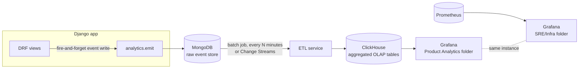

# 07 — Data Platform: MongoDB → ClickHouse → Grafana

## 7.1 Pipeline shape

Two independent failure domains, on purpose: if Mongo, the ETL job, or
ClickHouse is down, learners can still practice — the request path never
blocks on analytics. Only dashboards go stale. This is worth demonstrating
live in class: kill the ETL container mid-demo, keep practicing in the
frontend, show nothing breaks except the Grafana panels freezing.

## 7.2 MongoDB: event schema

One database (`tartarus_events`), collections split by event family so
indexes and TTLs can differ per family:

**`interaction_events`** — every learner-facing action:

| Field | Type | Notes |
|---|---|---|
| `_id` | ObjectId | |
| `event_type` | string | `session_started`, `question_shown`, `answer_submitted`, `drill_started`, `drill_completed`, `session_ended`, `session_cancelled` |
| `user_id` | int | FK to Postgres `accounts.User.id` — Mongo doesn't enforce this, the app does |
| `session_id` | UUID (string) | groups events within one practice session |
| `word_list_id` | int | |
| `track` | string | consolidation stage name or supplementary track name |
| `payload` | object | shape varies by `event_type` — e.g. `answer_submitted` carries `correct: bool`, `latency_ms`, `attempt_number`; deliberately **never** the raw answer text, matching the legacy app's existing "answer text and correct targets are deliberately excluded from every log line" logging discipline — that principle is *more* important here, not less, since this store persists far longer than a rotated log file |
| `ts` | ISODate | event time, server-assigned, not client-supplied (don't trust client clocks for anything time-series-critical) |

**`client_events`** — frontend errors/telemetry, direct successor to the
legacy `POST /api/client-log` endpoint: `event_type` (`js_error`,
`unhandled_rejection`, `ui_error_shown`), `user_id` (nullable — errors can
happen pre-login), `message`, `stack` (truncated), `ts`.

Indexes: `{session_id: 1, ts: 1}` and `{user_id: 1, ts: -1}` on
`interaction_events` — the two access patterns the ETL job and any direct
debugging queries actually need. A TTL index (e.g. 90 days) is a reasonable
default for a teaching deployment so the raw collection doesn't grow
unbounded during a semester — ClickHouse is the long-term store once data
has been aggregated.

## 7.3 ETL: Mongo → ClickHouse

**Default (teach this first): a scheduled batch job.** A small Python
service (`data-platform/etl/`), scheduled every 1–5 minutes **by whatever
mechanism the current stage provides** — and that per-stage difference is
deliberately part of the curriculum (ADR-7):
| Stage | How the ETL is scheduled |
|---|---|
| 1 — VM | `systemd` timer |
| 2 — Docker | host cron invoking `docker run`, or a small scheduler container |
| 3 — Swarm | a long-running scheduler service (Swarm has no native cron) |
| 4 — Kubernetes | a `CronJob` |

Each run: query `interaction_events` for documents newer than
the last high-water-mark timestamp it processed, transform, bulk-insert
into ClickHouse, advance the high-water mark. Simple, easy to reason about,
easy to demonstrate failure/recovery of (kill it mid-batch, restart, show
it resumes from the watermark without double-counting — a genuinely useful
idempotency lesson).

**Optional upgrade (advanced lab): Mongo Change Streams.** Tail the
`interaction_events` oplog-backed change stream instead of polling —
near-real-time instead of minutes-stale. Good follow-on lab specifically
about CDC (change data capture) once batch ETL is well understood; not the
default because it adds an always-running consumer process and
at-least-once delivery semantics that are more to reason about than a
teaching-first pipeline needs on day one.

## 7.4 ClickHouse schema

`MergeTree`-family tables, partitioned by month, ordered for the query
patterns the dashboards actually run:

**`events` (mirror of the Mongo stream, typed and flattened)**
`event_type` (LowCardinality String) · `user_id` (UInt32) · `session_id`
(UUID) · `word_list_id` (UInt32) · `track` (LowCardinality String) ·
`correct` (Nullable UInt8) · `latency_ms` (Nullable UInt32) · `ts`
(DateTime64) — `ENGINE = MergeTree PARTITION BY toYYYYMM(ts) ORDER BY
(user_id, ts)`.

**`daily_user_activity` (materialized/aggregated, refreshed by the ETL job)**
`date` · `user_id` · `sessions` · `words_practiced` · `correct_count` ·
`incorrect_count` · `drilled_count` · `active_seconds` — one row per
user per day, the table the "activity over time" and "cohort retention"
dashboard panels actually query, so those panels aren't scanning the raw
event table on every render.

**`mastery_funnel` (aggregated)**
`date` · `word_list_id` · `stage` · `items_entered` · `items_completed` —
feeds a funnel panel showing where learners drop off across the
Consolidation Track stages.

Why aggregate tables at all, given ClickHouse is already fast at raw scans:
because a *live classroom demo* dashboard needs to redraw in well under a
second against a simulator generating continuous load ([17](17-load-simulator.md)), and because
pre-aggregating is itself the lesson — "raw event tables and query-shaped
aggregate tables are different things, and conflating them is a common
performance mistake" is a real, transferable SRE/data-engineering lesson.

## 7.5 Grafana

Two dashboard folders from one Grafana instance (see [03](03-architecture-decisions.md) ADR-10 for why both
live together):

- **`Product Analytics`** (ClickHouse datasource) — daily active learners,
  accuracy trend by track, mastery funnel, session-length distribution,
  Leitner-box population over time. This is the "show the audience the
  application is alive and being used" dashboard set — the one the
  simulator in [17](17-load-simulator.md) exists to keep populated during a live demo.
- **`SRE / Infra`** (Prometheus + Loki datasources) — request rate/latency/
  error-rate (RED method) per service, Postgres replication lag (once
  Patroni is introduced), Redis hit rate, Varnish hit/miss ratio, container/
  pod resource usage, and a Loki log panel. This is the dashboard set used
  in Stage 4's chaos/failure labs ([16](16-stage-4-kubernetes.md)) and in the
  simulator's "outage scenario" ([17](17-load-simulator.md)).

Both folders are **provisioned as code**
(`data-platform/grafana/provisioning/`, dashboard JSON under
`data-platform/grafana/dashboards/`) rather than clicked together in the
UI — matches the "Reproducibility First" principle this whole plan is
built on, and means a fresh Stage 1/2/3/4 environment gets identical
dashboards for free on first boot.

Next: [08 — Caching: Redis and Varnish](08-caching.md).
